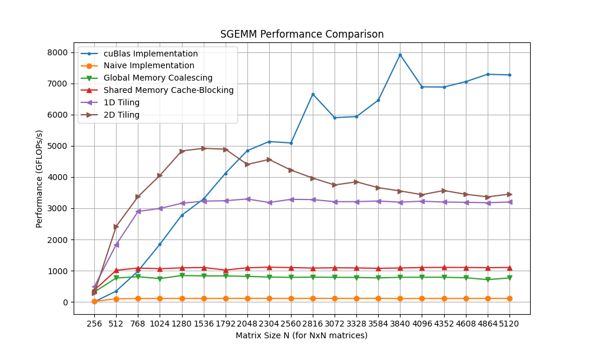

# take data input from sgemm impl
How to utilize the runner?
follow the instruction.

Example of my 3060 laptop


```
pip install matplotlib
mkdir build
cd build
cmake ..
make -j
./runner | python

```