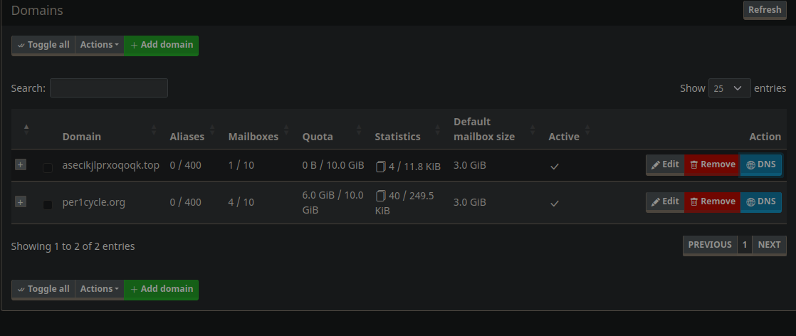
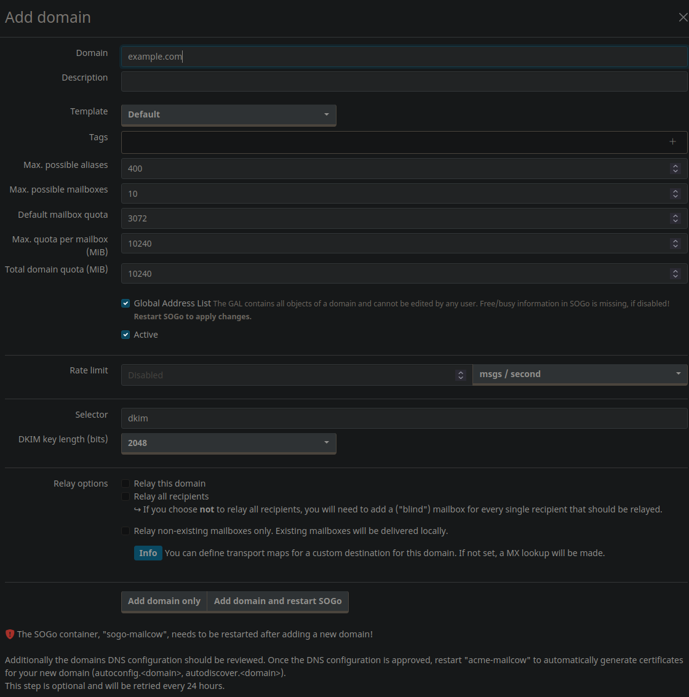
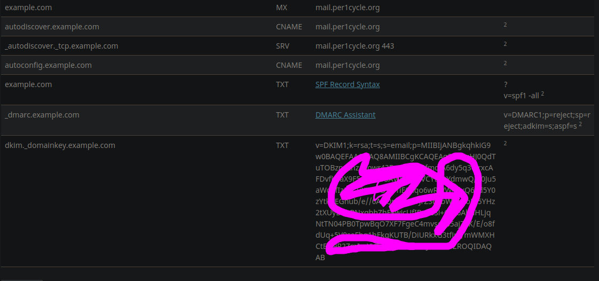

# Steps for hosting your mail service.

> Dont't panic!


## First
prepare your vps, recommend [hetzner](https://hetzner.com) for cheap and awesome vps.
you need at least use it for 1 month and at least 1 payment to free the out port for mail service.
and prepare your domain.

``` text
# e.g. my vps ipv4 address is 1.1.1.1
# my domain is per1cycle.org

```

## Second: DNS
setup minimal dns record
- A record

change the reverse dns look up in your hetzner cloud console.
> Notice don't proxy by the cloudflare!
e.g. 

## Third Setup
install mailcow for your vps.

setup guide [doc](https://docs.mailcow.email/)

### post install
- update the admin password
- -> Email -> Configuration -> Add domain
- Click the DNS button and follow the record to complete setup.

### Concepts:
- DKIM DomainKeys Identified Mail enables domain owners to automatically "sign" emails from their domain
- SPF Sender Policy Framework is a way for a domain to list all the servers they send emails from
- DMARC 

## Forth cli client
add neomutt as client!
```bash

apt/dnf install neomutt

```
sample configuration

``` bash
# ~/.config/neomutt/neomuttrc
set imap_user="me@per1cycle.org"
set imap_pass="<your password here>"
set folder = imaps://mail.per1cycle.org/
set spoolfile=imaps://mail.per1cycle.org/INBOX

set smtp_url="smtps://me@per1cycle.org@mail.per1cycle.org:465"
set smtp_pass="<your password here>"
set pager_stop = yes

set real_name='Huan Zhou' ; ignore x-
set from = "me@per1cycle.org"

set folder = "~/Disk/Mail" // the mail inboxes.
mailboxes =all
mailboxes =u-boot
mailboxes =u-boot/bpif3
mailboxes =u-boot/starfive
mailboxes =u-boot/spacemit
mailboxes =u-boot/sifive
mailboxes =u-boot/sophgo
mailboxes =floppy

# ======================Performence tuning======================

set header_cache="~/.cache/neomutt/header"
set message_cachedir="~/.cache/neomutt/message"

# ======================other setting======================
# Ctrl-P – Previous Mailbox
bind index,pager \CP sidebar-prev
# Ctrl-N – Next Mailbox
bind index,pager \CN sidebar-next
# Ctrl-O – Open Highlighted Mailbox
bind index,pager \CO sidebar-open

set sidebar_visible
set sidebar_format = "%B%<F? [%F]>%* %<N?%N/>%S"
set mail_check_stats
set use_threads=yes sort=date sort_aux=date
set ask_cc=yes


```

## Further steps
How to use your custom domain to access this mail server?
e.g. you domain is example.com

follow these steps:
- me<the website admin> manually add the domain.



- setup the follow dns record.


- add these to dns record

```text
$ORIGIN example.com.
@	IN	MX	mail.per1cycle.org
autodiscover	IN	CNAME	mail.per1cycle.org
_autodiscover._tcp	IN	SRV	mail.per1cycle.org 443
autoconfig	IN	CNAME	mail.per1cycle.org
@	IN	TXT	?
@	IN	TXT	v=spf1 -all
_dmarc	IN	TXT	v=DMARC1;p=reject;sp=reject;adkim=s;aspf=s
dkim._domainkey	IN	TXT	v=DKIM1;k=rsa;t=s;s=email;p=<key>

```

- then i'll manually add you mbx, and enjoy it.
